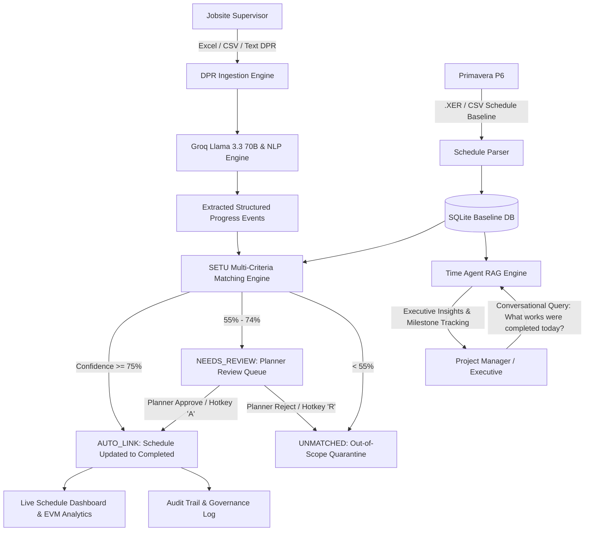

# 🏗️ SETU (सेतु) — AI-Powered Construction Schedule Reconciliation & Site Intelligence Platform

> **Automated, explainable, human-in-the-loop bridge between Primavera P6 project baselines and raw jobsite daily progress reports (DPRs).**

---

### 🔗 Quick Links & Media
- 🌐 **Live Demo Application:** `[Add Live App Link Here]`
- 📺 **YouTube Video Walkthrough:** `[Add YouTube Demo Video Link Here]`
- 📁 **GitHub Repository:** [sahilkhan09k/Set-SIH-26122](https://github.com/sahilkhan09k/Set-SIH-26122)

---

## 📌 Executive Summary

Large-scale Engineering, Procurement, and Construction (EPC) projects—such as oil refineries, petrochemical plants, highways, and thermal power facilities—suffer from a systemic coordination failure known as the **"Baseline-Execution Disconnect"**:

1. **The Primavera P6 Baseline** lives in the project controls office, structured hierarchically into Work Breakdown Structures (WBS), Activity Codes, and critical path schedules.
2. **The Daily Progress Reports (DPRs)** live on the construction frontlines, written by site supervisors in spreadsheets, WhatsApp messages, field notes, or voice memos using colloquial descriptions (e.g. *"Spool P24-17 erected on 8-inch process line at Rack R24"*).
3. **The Bottleneck**: Reconciling hundreds of daily site activities against thousands of P6 schedule codes currently requires senior planners to spend **15–20 hours per week** on manual cross-referencing. This delay leads to delayed variance reporting, inaccurate Earned Value Management (EVM), undetected critical path slippages, and costly contractor dispute claims.

**SETU** automates this entire pipeline through **deterministic construction NLP**, **Groq-powered Llama 3.3 70B intelligence**, and **human-in-the-loop verification**.

---

## 🌟 Key Features

### 1. 📊 Native Primavera P6 Schedule Ingestion (.XER, .CSV, .XLSX)
- Parses native Primavera P6 `.xer` binary/tab-delimited exports (`%T TASK` and `%T WBS` tables).
- Automatically extracts planned start/finish dates, physical percentage complete, planned durations, WBS hierarchy, locations, and disciplines (Civil, Piping, Electrical, Mechanical, Instrumentation, HSE).
- Supports project clearing and re-ingestion for rapid multi-project simulation.

### 2. 📑 Multimodal Daily Progress Report (DPR) Ingestion
- Ingests supervisor field reports in Excel (`.xlsx`), CSV (`.csv`), PDF, or raw text format.
- Extracts structured construction execution events:
  - **Discipline** (Piping, Civil, Electrical, Mechanical, Instrumentation, HSE)
  - **Activity Description**
  - **Location / Area** (e.g. Rack R24, Substation S2, Foundation F-204)
  - **Quantity & Unit** (e.g. 42 inch-dia, 45 m³, 35 metres)
  - **Execution Window** (Start & End hours)
  - **Personnel** (Reported By supervisor)

### 3. 🧠 Multi-Criteria Explainable Matching Engine
SETU evaluates candidate matches through a rigorous 5-dimension scoring matrix:
$$\text{Confidence} = 0.20 \times S_{\text{semantic}} + 0.20 \times S_{\text{fuzzy}} + 0.15 \times S_{\text{discipline}} + 0.20 \times S_{\text{location}} + 0.25 \times S_{\text{identifier}}$$

- **Tier 1: Auto-Link ($\ge 75\%$)**: High confidence matching where discipline, engineering tag numbers (e.g., `P24-17`, `PT-2401`), and location align. Automatically marks baseline activities as **Completed** and populates actual start/finish dates and quantities.
- **Tier 2: Needs Review ($55\% - 74\%$)**: Partial alignment (e.g., right discipline and description overlap, but ambiguous equipment tag). Routed to the Planner Review Queue for human sign-off.
- **Tier 3: Unmatched ($< 55\%$)**: Out-of-scope work, third-party vendor interventions, or safety drills clearly flagged to prevent schedule baseline contamination.

### 4. 🧑‍💼 Human-in-the-Loop (HITL) Planner Review
- **3-Column Verification Interface**:
  - **Column 1**: Raw field report snippet with source text highlighting.
  - **Column 2**: AI-extracted structured attributes & confidence breakdown (Semantic, Fuzzy, Discipline, Location, Tag).
  - **Column 3**: Candidate P6 baseline activity, natural language justification, and the 4-point Evidence Verification Matrix.
- **Instant Keyboard Shortcuts**: Press `[A]` to Approve & Push to schedule, `[R]` to Reject, or `[Arrow Keys]` to navigate.
- Approving any candidate immediately updates the baseline schedule activity to **Completed** and records an immutable audit log.

### 5. 🤖 Real-Time Conversational Time Agent (Construction RAG)
- Natural language query interface powered by **Groq Llama 3.3 70B** with real-time SQLite database grounding.
- Ask questions like:
  - *"What works were completed today?"*
  - *"What is the status of piping spool erection on Line 24-XX?"*
  - *"Show critical path impact and successor unblocking."*
- Generates executive engineering briefings detailing completed work packages, actual quantities, sequential milestones unblocked, and critical path float analysis.

### 6. 🛡️ Enterprise Audit Trail & Governance
- Complete auditability for construction dispute resolution and project claims.
- Every state change tracks: timestamp, user role, old value, new value, AI confidence, and justification.

---

## 🏛️ System Architecture



---

## 🛠️ Technology Stack

| Component | Technology | Purpose |
| :--- | :--- | :--- |
| **Frontend Framework** | React 18 + Vite | High-performance SPA with sub-second HMR |
| **Language** | TypeScript | End-to-end type safety across client and server |
| **Styling** | Vanilla CSS Design Tokens | Premium enterprise dark mode UI, zero dependency bloat |
| **Icons** | Lucide React | Lightweight, accessible UI icon system |
| **Backend Runtime** | Node.js 18+ / 22+ | REST API server with asynchronous execution |
| **Backend Framework** | Express.js | Robust routing for schedule, report, and match pipelines |
| **Database & ORM** | Prisma ORM + SQLite | Zero-configuration, file-based relational database |
| **AI / LLM Engine** | Groq Cloud API (Llama 3.3 70B Versatile) | Low-latency entity extraction & conversational RAG |
| **Offline Fallback** | Deterministic Industrial NLP Engine | Offline heuristic parser ensuring 100% platform availability |
| **Spreadsheet Parsing**| `xlsx` (SheetJS) | Binary Excel DPR reading & automated demo file generation |
| **Schedule Parsing** | Custom Primavera P6 `.xer` Lexer | Native `%T TASK` & `%T WBS` relational parsing |

---

## 📂 Project Structure

```
Setu/
├── demo_files/                          # Sample presentation files
│   ├── Refinery_Phase2_Schedule.xer     # Primavera P6 schedule baseline (18 activities)
│   ├── Supervisor_DPR_Today.xlsx        # Daily progress report dated today (9 activities)
│   └── Supervisor_DPR_18Sep2026.xlsx    # Alternative date DPR file
├── backend/                             # Express + Prisma Backend
│   ├── prisma/
│   │   ├── schema.prisma                # Relational data schema (Project, Activities, Matches)
│   │   └── dev.db                       # Local SQLite database
│   ├── scripts/
│   │   ├── createDemoXlsx.cjs           # Generates stratified demo Excel files
│   │   └── testWorkflow.cjs             # Automated end-to-end regression test suite
│   ├── src/
│   │   ├── routes/                      # API endpoint handlers
│   │   │   ├── schedule.routes.ts       # P6 schedule upload & activity management
│   │   │   ├── reports.routes.ts        # DPR ingestion, parsing & matching trigger
│   │   │   ├── matches.routes.ts        # Match queries, planner approve/reject/correct
│   │   │   ├── dashboard.routes.ts      # EVM KPIs, progress metrics & charts
│   │   │   ├── timeAgent.routes.ts      # Conversational RAG & progress query handler
│   │   │   └── audit.routes.ts          # Dispute log & compliance trail
│   │   ├── services/
│   │   │   ├── matchingEngine.ts        # 5-dimensional fuzzy/semantic correlation engine
│   │   │   ├── nlpEngine.ts             # Groq Llama 3.3 70B & deterministic NLP service
│   │   │   └── db.ts                    # Prisma client singleton & seed logic
│   │   └── server.ts                    # Server bootstrap & middleware
│   └── package.json
├── frontend/                            # React + Vite Frontend
│   ├── public/demo_files/               # Public download copies of demo files
│   ├── src/
│   │   ├── components/                  # Reusable UI widgets (ConfidenceBar, Toast, etc.)
│   │   ├── layouts/AppShell.tsx         # Sidebar navigation, top header, status pills
│   │   ├── pages/                       # Application Views
│   │   │   ├── Dashboard.tsx            # Executive KPI summary & progress charts
│   │   │   ├── Schedule.tsx             # P6 Schedule table with real-time status & dates
│   │   │   ├── UploadIngestion.tsx      # Multi-format DPR drag-and-drop ingestion
│   │   │   ├── ActivityMatches.tsx      # Correlated linkage table with confidence bars
│   │   │   ├── PlannerReview.tsx        # Human-in-the-loop 3-column verification queue
│   │   │   ├── TimeAgent.tsx            # Conversational progress capture & RAG assistant
│   │   │   └── AuditTrail.tsx           # Compliance & decision history
│   │   ├── services/api.ts              # Centralized backend API client
│   │   └── index.css                    # Design token variables & glassmorphism theme
│   └── package.json
├── .gitignore                           # Git ignore rules
└── README.md                            # Comprehensive project documentation
```

---

## 🚀 Getting Started

### Prerequisites
- **Node.js**: v18.0.0 or higher (v22.x recommended)
- **npm**: v9.0.0 or higher
- **Groq Cloud API Key** *(Optional, platform has built-in offline NLP fallback)*

### 1. Clone the Repository
```bash
git clone https://github.com/sahilkhan09k/Set-SIH-26122.git
cd Set-SIH-26122
```

### 2. Backend Setup
```bash
cd backend
npm install

# (Optional) Add your Groq API Key for live Llama 3.3 70B model execution
# Create a .env file in backend/
echo GROQ_API_KEY=your_groq_api_key_here > .env

# Initialize the SQLite database
npx prisma generate
npx prisma db push

# Start backend dev server (runs on port 5000)
npm run dev
```

### 3. Frontend Setup
In a new terminal:
```bash
cd frontend
npm install

# Start frontend dev server (runs on port 5173)
npm run dev
```

Open your browser at **`http://localhost:5173`**.

---

## 🎬 Step-by-Step Live Demo Guide

To demonstrate the complete end-to-end platform capabilities in your presentation:

### Step 1: Baseline Schedule Ingestion
1. Navigate to **Schedule** (`http://localhost:5173/schedule`).
2. Click **Upload Primavera P6 (.XER)** and select:
   ```
   demo_files/Refinery_Phase2_Schedule.xer
   ```
3. Highlight the 18 scheduled activities across Civil, Piping, Electrical, Mechanical, and Instrumentation disciplines initialized at `Not Started`.

### Step 2: Upload Daily Field Report (DPR)
1. Navigate to **Site DPR Ingestion** (`http://localhost:5173/upload`).
2. Drag & drop:
   ```
   demo_files/Supervisor_DPR_Today.xlsx
   ```
3. Click **Run Ingestion & AI Schedule Match**.
4. Observe the AI processing summary:
   - **3 Auto-Linked** (High confidence: Cable tray 96%, Foundation 93%, Spool 84%)
   - **3 Review Required** (Pump alignment 66%, DPT loop check 64%, Field weld 64%)
   - **3 Unmatched** (Emergency drill 4%, Road patching 27%, Diesel line 28%)

### Step 3: Verified Automatic Updates in Schedule
1. Return to **Schedule** (`http://localhost:5173/schedule`).
2. Show that `CIV-1102`, `ELE-3011`, and `PIP-2401` have automatically flipped to **`Completed`** (green badge), showing actual start & finish dates and executed quantities.

### Step 4: Human-in-the-Loop Planner Review
1. Navigate to **Activity Matches** (`http://localhost:5173/matches`).
2. Click **Review** on an activity (e.g., `INS-4020` or `MEC-5004`).
3. In **Planner Review** (`http://localhost:5173/review/:id`), show:
   - Left: Raw supervisor note.
   - Center: AI structured extraction & confidence matrix.
   - Right: Matched P6 baseline activity with justification.
4. Press **`[A]`** or click **Approve & Push**.
5. Check the schedule: `INS-4020` is now updated to **`Completed`** as well!

### Step 5: Conversational Schedule Intelligence (RAG)
1. Navigate to **Time Agent** (`http://localhost:5173/time-agent`).
2. Click the quick prompt pill: **"What works were completed today?"**
3. Watch the assistant query the live database and synthesize an executive engineering report itemizing the completed activities, executed scopes, and critical path impacts.

---

## 🔒 Governance, Safety & Dispute Avoidance

- **Explainability First**: Every match provides a natural language explanation and an evidence checklist (discipline, location proximity, tag correlation, WBS level).
- **Threshold Integrity**: Hard evidence boosts ensure valid activities link automatically, while ambiguous scope requires human sign-off.
- **Audit Logging**: Immutable tracking of automated decisions versus planner overrides for contractual claims and dispute defense.

---

## 👥 Contributors

- **Sahil Khan** — Project Lead & Platform Architect
- **Team SETU** — Smart India Hackathon (SIH-26122)

---

## 📄 License
This project is licensed under the MIT License — see the [LICENSE](LICENSE) file for details.
